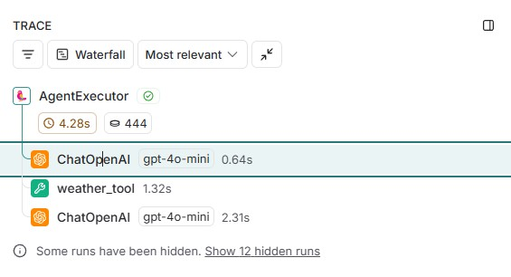

# Agent Tools 創建與追蹤

## 項目概述
本項目專注於開發和展示工具調用（Tools Calling）功能，並使用LangSmith進行監控和分析。LangSmith提供以下功能：
- **調用流程可視化**: 清晰展示工具調用流程
- **性能監控**: 追蹤工具執行效率
- **錯誤診斷**: 快速定位和解決問題

## 項目簡介
本項目提供兩個實用的工具：
1. 天氣查詢工具 - 查詢臺灣各縣市的天氣資訊
2. 文章摘要工具 - 自動生成文章摘要，可選關鍵字分析

## 工具列表

### 1. 天氣查詢工具 (weather_tool)
- **功能**: 查詢臺灣縣市的天氣資料
- **輸入格式**: 
  - `city`: 臺灣縣市名稱（需繁體中文，如'臺北市'）
- **特點**:
  - 自動將「台」轉換為「臺」
  - 自動補上「市」或「縣」

**使用示例**:
```python
from tools import weather_tool

# 查詢臺北市天氣
result = weather_tool.run("臺北市")
print(result)
```

**執行結果與分析**:
- [查看LangSmith執行流程](https://smith.langchain.com/public/ba158f91-b1c9-4fc6-adf6-7dfe8804ad60/r)

### 2. 文章摘要工具 (ArticleSummarizerTool)
- **功能**: 生成文章摘要，可選關鍵字分析
- **輸入格式**:
  - `text`: 要摘要的文章內容
  - `max_length`: 摘要的最大字數（默認100）
  - `keywords`: 是否包含關鍵字分析（默認False）

**使用示例**:
```python
from tools import ArticleSummarizerTool

# 創建工具實例
summarizer = ArticleSummarizerTool()

# 生成摘要
text = "這裡是一篇長文章內容..."
result = summarizer.run(text, max_length=150, keywords=True)
print(result)
```

**執行結果與分析**:
- [查看LangSmith執行流程](https://smith.langchain.com/public/c3ef486a-8721-40b6-88b5-aeba3310535f/r)

## 工具選擇邏輯

### 1. 天氣查詢工具 (weather_tool)


### 2. 文章摘要工具 (ArticleSummarizerTool)


工具調用邏輯由LangChain的AgentExecutor處理，它會根據以下流程選擇合適的工具：

1. **解析用戶輸入**
2. **匹配工具描述**:
   - 比較用戶輸入與每個工具的`description`
   - 計算語義相似度
   - 選擇最匹配的工具
3. **輸入驗證**
4. **執行工具**
5. **返回結果**

## LangChain 工具創建方式與Pydantic整合

### Pydantic Field 介紹
- **作用**: 定義模型字段的元數據和驗證規則
- **常用參數**:
  - `description`: 字段的描述信息
  - `default`: 字段的默認值
  - `alias`: 字段的別名
  - `min_length`/`max_length`: 字符串長度限制
  - `gt`/`lt`: 數值範圍限制
  - `regex`: 正則表達式驗證
- **示例**:
```python
from pydantic import BaseModel, Field

class ExampleModel(BaseModel):
    name: str = Field(description="用戶姓名", min_length=2, max_length=50)
    age: int = Field(description="用戶年齡", gt=0, lt=120)
```

## 總結

LangChain 提供了多種創建工具的方式均與Pydantic深度整合：

### 1. 函數式寫法 (StructuredTool.from_function)
- **特點**: 
  - 由 LangChain 内部自動生成 args_schema
  - 基於Pydantic的類型提示自動驗證輸入
- **優點**: 
  - 簡單快速，適合簡單的工具
  - 自動處理輸入驗證
- **示例**: 天氣查詢工具採用此方式
- **Pydantic角色**:
  - 自動從函數簽名生成輸入schema
  - 驗證輸入參數的類型和格式

### 2. 類別式寫法 (BaseTool + BaseModel)
- **特點**: 
  - 透過繼承BaseModel定義參數規則
  - 完全控制輸入驗證邏輯
- **優點**: 
  - 更靈活，適合複雜的工具
  - 可自定義驗證規則
- **示例**: 文章摘要工具採用此方式
- **Pydantic角色**:
  - 定義嚴格的輸入schema
  - 提供豐富的驗證功能
  - 支持嵌套數據結構

## 工具調用邏輯

1. **輸入驗證**:
   - 使用Pydantic schema驗證輸入參數
   - 自動轉換數據類型
   - 提供清晰的錯誤信息

2. **執行流程**:
   - 調用工具的`_run`方法
   - 處理業務邏輯
   - 返回結果

3. **錯誤處理**:
   - 捕獲並處理異常
   - 返回標準化錯誤信息

4. **非同步支持**:
   - 可選實現`_arun`方法
   - 支持非同步調用

## 注意事項
1. 天氣查詢工具依賴外部API，請確保網絡連接正常
2. 文章摘要工具目前使用簡單的算法，適用於短文本
3. 如需更高級的摘要功能，可考慮集成NLP模型

## 開發指南
安裝依賴: `pip install -r requirements.txt`
